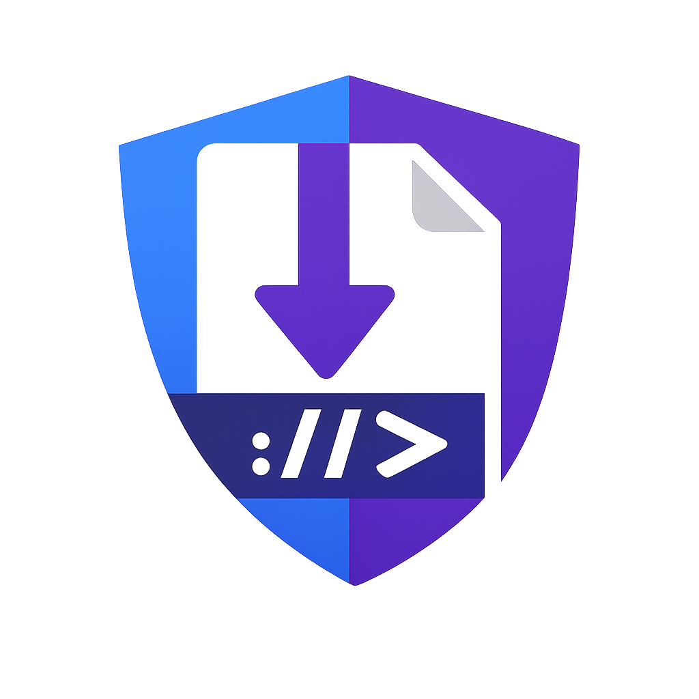
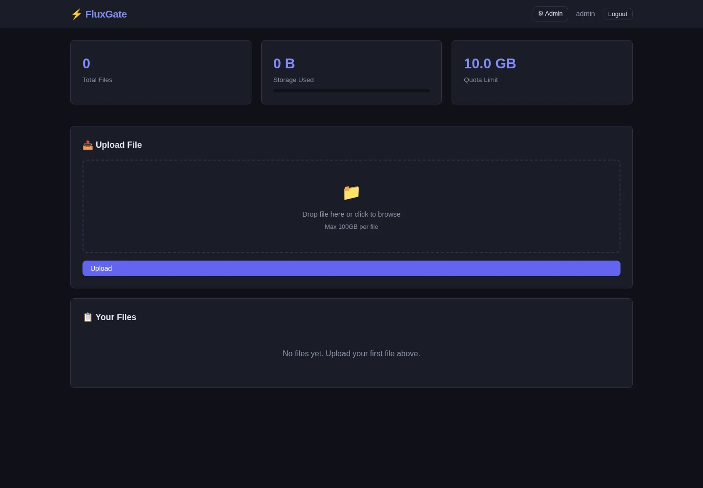
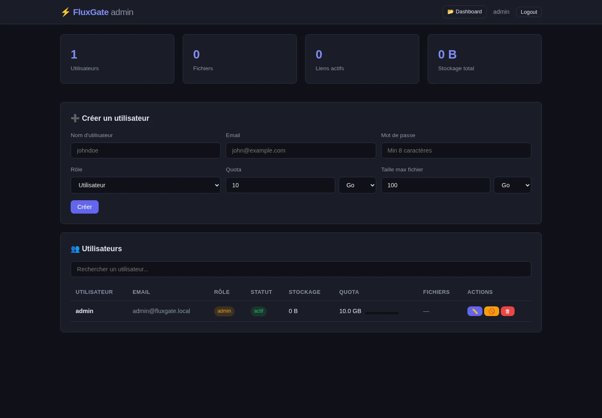

<p align="center">
  
</p>

# FluxGate

FluxGate is a self-hosted file distribution service built for browsers,
`curl`, `wget`, automation, and large files. It provides a web interface, a
REST API, a CLI, expiring download links, quotas, and local or S3-compatible
storage.

[](LICENSE)
[](https://github.com/HeartBtz/fluxgate/pkgs/container/fluxgate)

## Features

- Direct binary downloads with Range request support for `curl` and `wget`.
- Browser dashboard and administrator interface with no external CDN assets.
- JWT and scoped API-key authentication.
- Public, password-protected, and HMAC-signed links with expiration and
  download limits.
- Streaming direct uploads and resumable chunk uploads on local storage.
- Per-user quotas, file-size limits, extension and MIME controls.
- Local filesystem and S3-compatible object storage backends.
- Background cleanup for expired links, files, and upload sessions.
- Health, readiness, and optional Prometheus metrics endpoints.

## Interface

These screenshots come from an isolated application stack populated only with
synthetic credentials and empty demo storage.





## Install With Docker Compose

Docker Compose is the supported complete installation path. It starts one
FluxGate application container and PostgreSQL with persistent named volumes.

Requirements: Git, Docker Engine, and Docker Compose v2.

```bash
git clone https://github.com/HeartBtz/fluxgate.git
cd fluxgate
cp .env.example .env

# Fill these values in .env. Use a unique value for each secret.
openssl rand -hex 24  # DB_PASSWORD
openssl rand -hex 32  # JWT_SECRET
openssl rand -hex 32  # HMAC_SECRET
openssl rand -base64 24  # ADMIN_PASSWORD for first start only

docker compose config --quiet
docker compose up -d --build
docker compose ps
curl --fail http://127.0.0.1:8080/health
```

Set the generated values in `.env`; do not paste the comments or command output
into shell history as assignments. `DB_PASSWORD`, `JWT_SECRET`, and
`HMAC_SECRET` are required. Set `ADMIN_PASSWORD` for the first successful start,
then remove its value from `.env` and run `docker compose up -d` so the bootstrap
password is no longer present in the application container environment.

The default bind is `127.0.0.1:8080`. For public use, keep that bind and place a
TLS reverse proxy on the same host in front of FluxGate. Set `BASE_URL` to the
external HTTPS origin and set `FLUXGATE_TRUSTED_PROXIES` only to the proxy's
actual IP or CIDR. Do not expose PostgreSQL; Compose keeps it on an internal
network.

The Compose file can build from the checkout and names the result
`ghcr.io/heartbtz/fluxgate`. Published OCI images, when available, are at
`ghcr.io/heartbtz/fluxgate:<version>` and link back to the
[public source repository](https://github.com/HeartBtz/fluxgate).

### Update

Updates must not overlap application writers.

```bash
git pull --ff-only
docker compose build --pull fluxgate
docker compose up -d --no-deps fluxgate
docker compose ps
curl --fail http://127.0.0.1:8080/health
```

Database migrations run when FluxGate starts. Read release notes and take a
backup before updating. If using a published image instead of a local build,
set `FLUXGATE_VERSION` to an immutable release tag and run
`docker compose pull fluxgate` before `docker compose up -d --no-deps fluxgate`.

### Backup

Stop the single writer before capturing the database and file volume. These
commands create logical PostgreSQL and local-storage archives without removing
containers or volumes.

```bash
mkdir -p backups
docker compose stop fluxgate
docker compose exec -T postgres pg_dump -U fluxgate -d fluxgate -Fc > backups/fluxgate-db.dump
docker compose run --rm --no-deps --entrypoint tar fluxgate -C /data/files -czf - . > backups/fluxgate-files.tar.gz
docker compose start fluxgate
curl --fail http://127.0.0.1:8080/health
```

Also back up `.env` through a secret-management system. Store backups away from
the Docker host and test restoration regularly. With S3 storage, use the object
store's versioning and backup facilities instead of the local file archive.

## Configuration

`.env.example` contains exactly the values consumed by `docker-compose.yml`.
The application itself is configured with `FLUXGATE_*` environment variables;
Compose maps the commonly needed values below.

| Compose value | Purpose | Default |
| --- | --- | --- |
| `BASE_URL` | Public HTTP(S) origin, without a path | `http://localhost:8080` |
| `BIND_ADDRESS`, `PORT` | Host bind address and port | `127.0.0.1`, `8080` |
| `DB_PASSWORD` | PostgreSQL password | required |
| `JWT_SECRET` | JWT signing secret, at least 32 characters | required |
| `HMAC_SECRET` | Download URL signing secret, at least 32 characters | required |
| `ADMIN_USERNAME` | Initial administrator name | `admin` |
| `ADMIN_PASSWORD` | Initial administrator password, 8-72 bytes | empty |
| `FLUXGATE_TRUSTED_PROXIES` | Comma-separated trusted proxy IPs/CIDRs | empty |
| `FLUXGATE_CORS_ORIGIN` | Allowed browser origin; empty uses `BASE_URL` | empty |
| `FLUXGATE_MAX_CONCURRENT_DL` | Concurrent downloads per process | `100` |
| `FLUXGATE_MAX_CONCURRENT_UPLOADS` | Concurrent uploads per process | `16` |
| `STORAGE_BACKEND` | `local` or `s3` | `local` |
| `STORAGE_MIN_FREE_BYTES` | Free-space floor for local storage | `1073741824` |
| `S3_*` | S3 endpoint, region, bucket, credentials, and transport options | see `.env.example` |
| `FLUXGATE_LOG_LEVEL` | `debug`, `info`, `warn`, or `error` | `info` |

Additional application settings are defined with defaults and validation in
[`internal/config/config.go`](internal/config/config.go). Important controls
include HTTP timeouts, database pool sizing, upload and quota limits, allowed or
blocked extensions and MIME types, cleanup intervals, and TLS certificate paths.

To use S3, set `STORAGE_BACKEND=s3` and all required `S3_*` credentials. The
bucket must already exist and remain private. Direct uploads use S3 multipart
upload, but persisted resumable upload sessions are not supported on S3.

Prometheus metrics are implemented but disabled in the Compose deployment. When
enabled in a source deployment with `FLUXGATE_METRICS_ENABLED=true`, the metrics
server listens on loopback at `127.0.0.1:<FLUXGATE_METRICS_PORT>`.

## API

All API routes use the `/api/v1` prefix. Authenticate with
`Authorization: Bearer <jwt>` or `Authorization: ApiKey <key>`. API keys are
never accepted in query strings.

```bash
BASE=http://127.0.0.1:8080
TOKEN=$(curl --fail --silent --show-error \
  -H 'Content-Type: application/json' \
  -d '{"username":"admin","password":"your-password"}' \
  "$BASE/api/v1/auth/login" | jq -r .token)

curl --fail -H "Authorization: Bearer $TOKEN" "$BASE/api/v1/files"

curl --fail -X POST \
  -H "Authorization: Bearer $TOKEN" \
  -H 'X-Filename: archive.tar.gz' \
  -H 'Content-Type: application/octet-stream' \
  --data-binary @archive.tar.gz \
  "$BASE/api/v1/files/upload"
```

Create links with `POST /api/v1/links`, inspect quota at
`GET /api/v1/files/quota`, and manage API keys under `/api/v1/apikeys`. Download
links use `/d/{token}/{filename}` and support `HEAD` and byte ranges.

## CLI

Build the CLI with `make cli`, then configure either `FLUXGATE_API_KEY` or
`FLUXGATE_TOKEN` and optionally `FLUXGATE_SERVER`.

```bash
./bin/fluxgate-cli login -server https://files.example.com -user admin -pass '...'
./bin/fluxgate-cli upload -key 'fg_...' file.iso
./bin/fluxgate-cli upload -key 'fg_...' -session '<session-id>' file.iso
./bin/fluxgate-cli link -key 'fg_...' -file '<file-id>' -type public -expires 7d
./bin/fluxgate-cli files -key 'fg_...'
./bin/fluxgate-cli delete -key 'fg_...' '<file-id>'
```

The CLI uploads in resumable chunks and prints the session ID needed to resume
the same local file after an interrupted transfer. This path requires local
storage.

## Develop From Source

Requirements: the Go toolchain declared in `go.mod` and PostgreSQL 16 or later.

```bash
go mod download
make test
make build
```

For a local server, create an isolated PostgreSQL database, export the required
`FLUXGATE_DB_*`, `FLUXGATE_JWT_SECRET`, `FLUXGATE_HMAC_SECRET`, and initial
administrator variables, then run `make dev`. Migrations apply automatically.
There is no Node.js project or JavaScript package installation step.

Useful targets are `make build`, `make test`, `make lint`, `make docker`,
`make up`, `make down`, and `make logs`.

## Security Limitations

- Run exactly one FluxGate writer for a given database and storage backend.
  Transfer locks and cleanup coordination are process-local. Multiple replicas,
  rolling overlap, and active-active operation are unsafe.
- FluxGate does not provide application-level encryption at rest. Encrypt the
  host volume or S3 bucket and protect database and backup storage separately.
- Resumable uploads are supported only by local storage, not S3. S3 direct
  uploads are multipart but cannot be resumed through a FluxGate session.
- Public and signed download links are bearer capabilities. Anyone with a valid
  link can use it until it expires, is revoked, or reaches its limit.
- A ranged request counts as a download for limited links. Interrupted or
  parallel clients may consume more than one allowed download.
- HTTPS termination, request and idle limits, secret rotation, malware scanning,
  encrypted backups, and restore testing are operator responsibilities.
- `/health` checks database access and storage metadata access. It does not prove
  write capacity, object integrity, backup quality, or recoverability.

See [SECURITY.md](SECURITY.md) for private vulnerability reporting.

## Contributing

See [CONTRIBUTING.md](CONTRIBUTING.md). Please keep changes focused and include
tests for behavior changes.

## License

FluxGate is licensed under the [Apache License 2.0](LICENSE).
